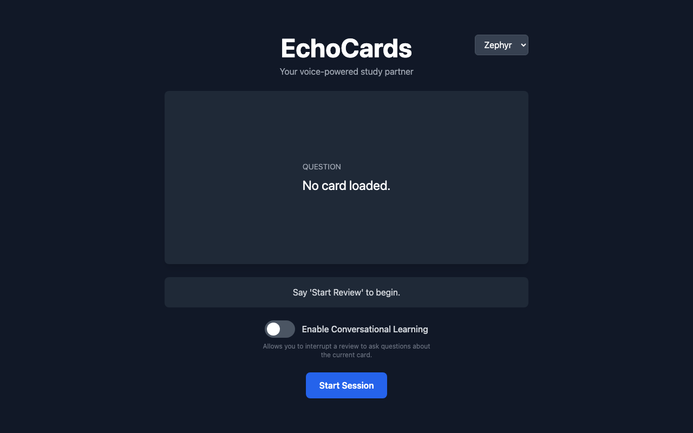

# EchoCards

[](https://opensource.org/licenses/MIT)
[](https://reactjs.org/)
[](https://www.typescriptlang.org/)
[](https://vitejs.dev/)
[](https://nodejs.org/)

🎙️ **Voice-powered flashcard app with AI deck generation, multimodal features, and FSRS spaced repetition algorithm**

EchoCards is an innovative study application that combines voice interaction, AI-powered content generation, and scientifically-proven spaced repetition to create an optimal learning experience. Study hands-free with natural voice commands, generate decks from any topic or document, and leverage multimodal AI capabilities.



## ✨ Features

### 🎤 Voice-Powered Review
- **Natural voice interaction** with Google Gemini 2.5 Flash Native Audio
- Hands-free flashcard review - no clicking required
- Real-time speech recognition and text-to-speech
- 5 AI voice options (Zephyr, Puck, Charon, Kore, Fenrir)
- **Conversational Learning Mode** - ask questions about cards during review

### 🧠 FSRS Spaced Repetition
- Implements the **FSRS-4.5 algorithm** for optimal retention
- Scientific scheduling based on memory stability and difficulty
- 4 rating options: Again, Hard, Good, Easy
- Tracks card states: NEW → LEARNING → REVIEW
- Built-in forgetting curve optimization

### 🤖 AI Deck Generation
- **Topic-based generation**: "Create a deck about quantum physics"
- **Document-based generation**: Upload text/articles to create targeted decks
- **Weakness-focused cards**: AI analyzes your review history and creates practice cards for weak areas
- Powered by Google Gemini 2.5 Pro with thinking budget

### 🎨 Multimodal AI Features
- **Image Generation**: Create visual aids with Google Imagen 4.0
- **Image Analysis**: Upload diagrams/charts for AI explanations
- **Audio Transcription**: Record and transcribe study notes
- **Text Analysis**: Summarize and analyze study materials
- Switch between simple (Fast) and complex (Pro) AI models

### 💾 Backup & Export System
- **3 export formats**: JSON (full backup), CSV (spreadsheet), Anki (TXT/TSV)
- **2 import strategies**: Merge (add new data) or Replace (complete restore)
- **Data integrity**: SHA-256 checksums and validation
- **Migration support**: Export to Anki for seamless integration

### 📊 Study Progress Tracking
- Daily/session goals with visual progress bars
- Per-card FSRS statistics (stability, difficulty, review count)
- Review history and lapse tracking
- Due date calculations and scheduling

### 🎯 Smart Card Management
- Create, edit, and delete cards with voice or UI
- Search and filter decks
- Card explanations on demand
- Deck-level statistics and insights

## 🚀 Quick Start

### Prerequisites
- **Node.js 20+** (for frontend and backend)
- **Google Gemini API key** ([Get one free](https://aistudio.google.com/apikey))

### Installation

```bash
# Clone the repository
git clone https://github.com/matheus-rech/echocards-voice-flashcards.git
cd echocards-voice-flashcards

# Install frontend dependencies
npm install

# Install backend dependencies
cd server
npm install
cd ..
```

### Configuration

1. **Frontend API key** (create `.env.local` in root):
```env
GEMINI_API_KEY=your_gemini_api_key_here
```

2. **Backend API key** (create `server/.env`):
```env
GEMINI_API_KEY=your_gemini_api_key_here
PORT=3001
```

### Run the Application

**Option 1: Run both servers separately (Recommended)**

```bash
# Terminal 1: Start backend (port 3001)
cd server
npm start

# Terminal 2: Start frontend (port 3000)
npm run dev
```

**Option 2: Production build**

```bash
# Build frontend
npm run build

# Serve production build
npm run preview
```

### Access the App

Open your browser and navigate to:
- **Frontend**: http://localhost:3000
- **Backend Health**: http://localhost:3001/health
- **Gemini API Health**: http://localhost:3001/api/gemini/health

## 📖 Usage Guide

### Voice Commands

Click anywhere on the page to start a voice session, then say:

**Review Commands:**
- "Start review [deck name]" - Begin reviewing a deck
- "Show answer" - Reveal the answer
- "Good" / "Easy" / "Hard" / "Again" - Rate your knowledge
- "Stop review" - End the current session

**Deck Management:**
- "Create a deck called [name]" - Create a new deck
- "List all decks" or "Show decks" - View all decks
- "Delete deck [name]" - Remove a deck

**Card Operations:**
- "Add a card to [deck name]" - Create a new card
- "Edit the card about [topic] in [deck]" - Modify a card
- "Show stats for [card/deck]" - View FSRS statistics

**AI Features:**
- "Generate a deck about [topic]" - AI creates flashcards
- "Create image: [description]" - Generate visual aids
- "Analyze this image" - Upload and analyze images

### UI Controls

- **Voice Selector**: Choose from 5 AI voices
- **Conversational Mode**: Toggle to ask questions during review
- **Action Buttons**: Access all features via toolbar
- **Deck Cards**: Click on any deck to view/edit cards
- **Audio Controls**: Play/Pause/Stop for manual control

## 🛠️ Tech Stack

### Frontend
- **React 19.2.0** - UI framework
- **TypeScript 5.8** - Type safety
- **Vite 6.4** - Build tool and dev server
- **Web Speech API** - Voice recognition
- **Web Audio API** - Audio playback

### Backend
- **Express.js** - REST API server
- **Rate Limiting** - 100 req/15min (standard), 10 req/15min (images)
- **CORS** - Whitelist-based security
- **Helmet** - Security headers
- **Morgan** - HTTP logging

### AI Models
- **Gemini 2.5 Flash (Native Audio)** - Voice conversations (~$0.01/min)
- **Gemini 2.5 Flash (TTS)** - Text-to-speech (~$0.001/card)
- **Gemini 2.5 Pro** - Complex operations (~$0.10/deck)
- **Gemini 2.5 Flash** - Image/text analysis (~$0.001/request)
- **Imagen 4.0** - Image generation (~$0.04/image)

### Data & Algorithms
- **FSRS-4.5** - Spaced repetition algorithm
- **localStorage** - Client-side persistence
- **SHA-256** - Data integrity checksums

## 📂 Project Structure

```
echocards-voice-flashcards/
├── src/
│   ├── components/          # React components
│   │   ├── AudioControls.tsx
│   │   ├── CardView.tsx
│   │   ├── DeckListView.tsx
│   │   ├── SmartGenerationView.tsx
│   │   ├── BackupView.tsx
│   │   └── ...
│   ├── services/            # Business logic
│   │   ├── geminiService.ts       # AI integration
│   │   ├── storageService.ts      # Data persistence
│   │   ├── fsrs.ts                # Spaced repetition
│   │   ├── exportService.ts       # Backup system
│   │   └── ...
│   ├── types.ts             # TypeScript definitions
│   └── App.tsx              # Main application
├── server/
│   ├── server.js            # Express backend
│   ├── routes/
│   │   └── gemini.js        # API proxy routes
│   └── middleware/
│       ├── rateLimit.js     # Rate limiting
│       └── errorHandler.js  # Error handling
├── docs/                    # Documentation
│   ├── QUICK_START.md
│   ├── BACKEND_SETUP.md
│   ├── DEMO_GUIDE.md
│   └── ...
└── package.json
```

## 🔐 Security Features

- **API key protection**: Keys stored server-side, never exposed to browser
- **Backend proxy**: All AI requests go through secure backend
- **Rate limiting**: Prevents API abuse
- **CORS whitelist**: Only localhost:3000 allowed
- **Helmet security**: HTTP headers hardening
- **Environment variables**: API keys in .env files (gitignored)
- **Input validation**: All user inputs sanitized

## 📊 Performance

- **Voice response time**: <1 second (Gemini 2.5 Flash Native Audio)
- **TTS generation**: ~500ms per card
- **Deck generation**: 5-15 seconds for 10 cards
- **Image generation**: 5-10 seconds (Imagen 4.0)
- **Image analysis**: 2-3 seconds
- **Storage**: Instant (localStorage)

## 📝 Documentation

- **[QUICK_START.md](QUICK_START.md)** - 5-minute setup guide
- **[BACKEND_SETUP.md](BACKEND_SETUP.md)** - Complete backend configuration
- **[DEMO_GUIDE.md](DEMO_GUIDE.md)** - 19 test scenarios with examples
- **[UI_WALKTHROUGH.md](UI_WALKTHROUGH.md)** - Visual UI reference
- **[PHASE1_IMPLEMENTATION_SUMMARY.md](PHASE1_IMPLEMENTATION_SUMMARY.md)** - Backend security implementation
- **[PHASE2_IMPLEMENTATION_SUMMARY.md](PHASE2_IMPLEMENTATION_SUMMARY.md)** - Backup system implementation
- **[ERROR_HANDLING_SUMMARY.md](ERROR_HANDLING_SUMMARY.md)** - Error handling system

## 🤝 Contributing

Contributions are welcome! Please feel free to submit a Pull Request.

1. Fork the repository
2. Create your feature branch (`git checkout -b feature/AmazingFeature`)
3. Commit your changes (`git commit -m 'Add some AmazingFeature'`)
4. Push to the branch (`git push origin feature/AmazingFeature`)
5. Open a Pull Request

## 📄 License

This project is licensed under the MIT License - see the [LICENSE](LICENSE) file for details.

## 🙏 Acknowledgments

- **Google Gemini AI** - Multimodal AI capabilities
- **FSRS Algorithm** - Scientifically-proven spaced repetition
- **React & Vite** - Modern frontend development
- **Express.js** - Reliable backend framework

## 📞 Support

- **Issues**: [GitHub Issues](https://github.com/matheus-rech/echocards-voice-flashcards/issues)
- **Discussions**: [GitHub Discussions](https://github.com/matheus-rech/echocards-voice-flashcards/discussions)

## 🚀 Roadmap

- [ ] Mobile app (React Native)
- [ ] Collaborative decks (shared study sessions)
- [ ] Advanced analytics dashboard
- [ ] More AI models (OpenAI, Claude)
- [ ] Offline mode with service workers
- [ ] Browser extension

---

**Made with ❤️ using Google Gemini AI**

🤖 Generated with [Claude Code](https://claude.com/claude-code)
